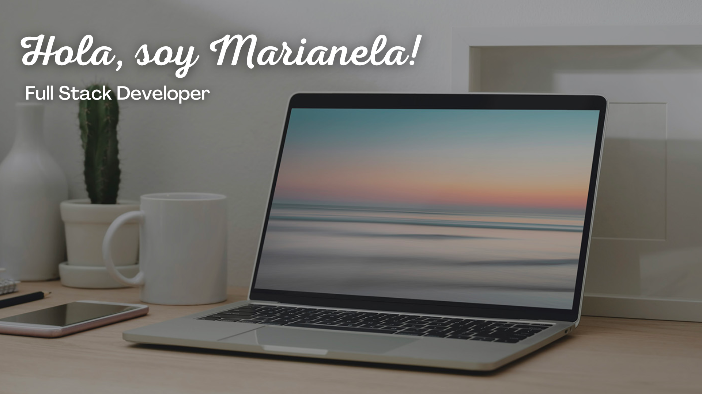

¿Quién soy? 
✨Desarrolladora enfocada en crecer profesionalmente cada día. Encontré en la programación mi pasión gracias a que une dos cosas que amo, vivir obteniendo nuevos conocimientos y trabajar en equipo.
Con excelente capacidad resolutiva, siempre buscando maneras rápidas y eficaces de solucionar los problemas.
Inicié mi capacitación en la academia Henry y me sigo capacitando constantemente de manera autodidacta.

¿Querés saber más de mi? ¡Contáctame!
✉️ [Email] (maguiherediavaiarini@gmail.com)
📞 Cel: (+54) 3541201933
👤 [Portfolio] (https://portfolio-marianela-heredia.vercel.app/)
💬 [LinkedIn] (https://www.linkedin.com/in/marianela-heredia-/)

