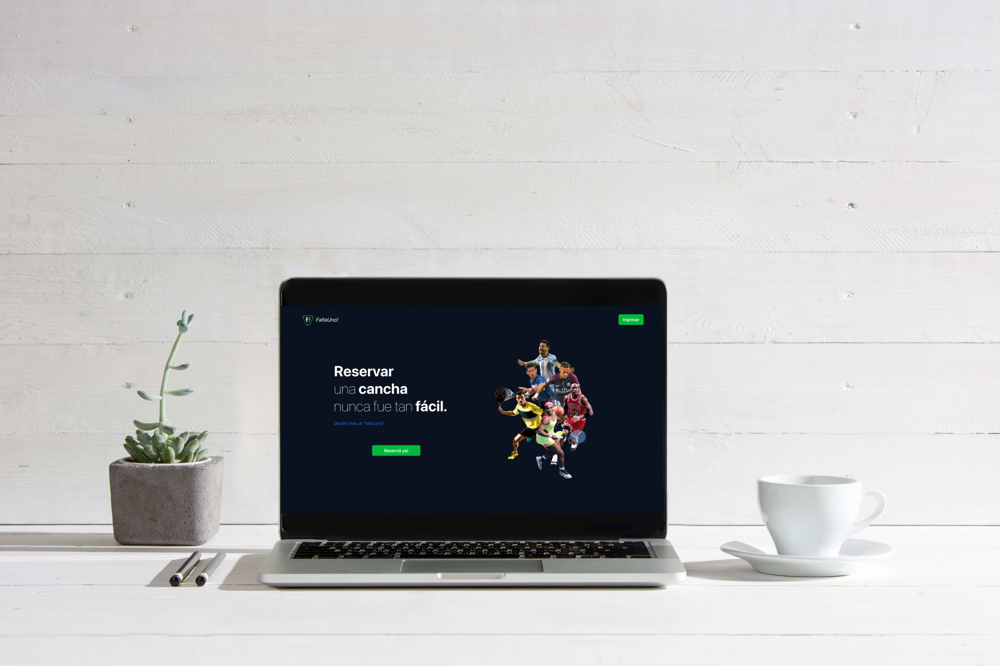
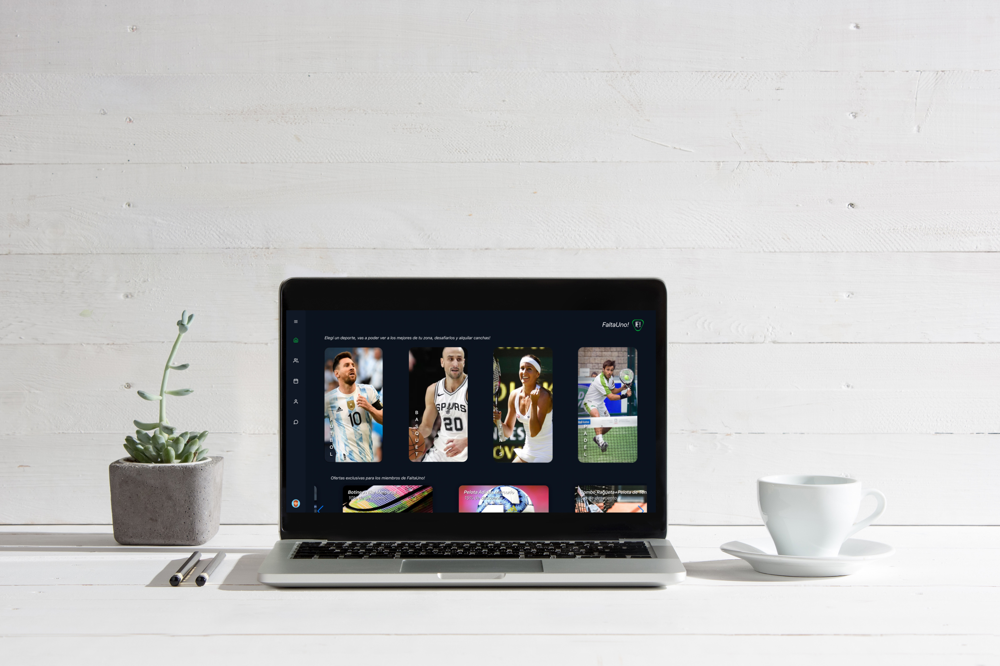

## ¿Quién soy? 
✨ Desarrolladora especializada como Front End Developer. Curiosa, con ganas de aprender siempre cosas nuevas que me ayuden a crecer personal y profesionalmente cada día.
Con excelente capacidad resolutiva, siempre buscando maneras rápidas y eficaces de solucionar los problemas, y con buena capacidad de liderazgo.
Inicié mi capacitación en la academia Henry y me sigo capacitando constantemente de manera autodidacta.

## Proyectos
* FaltaUno! Es una App para el alquiler de canchas y elementos deportivos de diferentes complejos. Cuenta con funcionalidades como: login, paserala de pago, chat interno, calendario y notificaciones, entre otras. Mi trabajo en la app estuvo enfocado en todo lo relacionado con las vistas y funcionalidades de los dueños de canchas, y el panel de administrador.

## ¿Querés saber más de mi? ¡Contáctame!
* ✉️ Email: maguiherediavaiarini@gmail.com
* 📞 Cel: (+54) 3541201933
* 👤 Portfolio: https://portfolio-marianela-heredia.vercel.app/
* 💬 LinkedIn: https://www.linkedin.com/in/marianela-heredia-/

